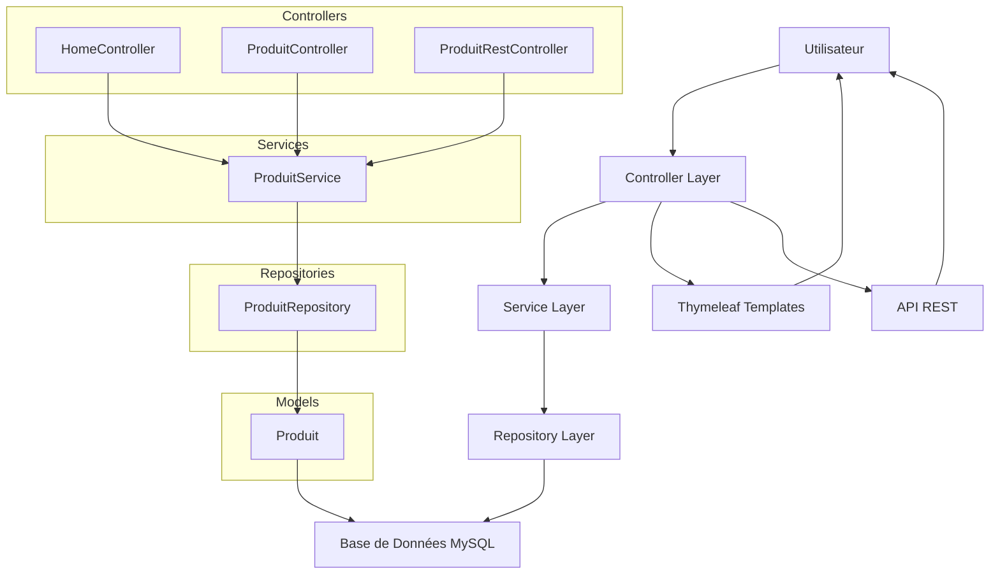

# Gestion des Produits - Boutique de Thés

## Description
Ce projet est une application web développée avec **Spring Boot** pour la gestion d'une boutique de thés. Elle permet de gérer un catalogue de produits (thés) via une interface web simple et intuitive. L'application utilise **JPA** pour l'accès aux données et **MySQL** comme base de données. Le thème est centré sur les thés, avec des fonctionnalités CRUD complètes, des recherches avancées, des filtres, et des exports.

Ce projet fait partie d'un exercice académique à SUP DE VINCI, réalisé le 13 janvier 2026.

## Fonctionnalités
- **CRUD complet** : Créer, lire, mettre à jour et supprimer des produits (thés).
- **Modèle Produit** : Chaque thé a un ID, nom, type (Vert, Noir, Oolong, Blanc, Pu-erh), origine (Chine, Japon, Inde, Sri Lanka, Taiwan), prix (5-100€), quantité en stock, description, et date de réception.
- **Interface web** : Templates Thymeleaf pour une navigation fluide (liste des produits, formulaires d'ajout/modification).
- **Recherche et filtres** : Recherche par nom, filtre par type de thé.
- **Tri** : Tri sur les colonnes (nom, prix, quantité).
- **Confirmation de suppression** : Alerte JavaScript avant suppression.
- **Pagination** : Affichage de 10 produits par page.
- **Export CSV** : Bouton pour exporter la liste des produits en fichier CSV.
- **Validation** : Contrôles côté serveur pour les champs obligatoires et les contraintes (e.g., prix entre 5 et 100).
- **API REST** : Endpoints REST pour une intégration externe (e.g., via Postman).

## Technologies utilisées
- **Backend** : Spring Boot (avec Spring Web, Spring Data JPA)
- **Base de données** : MySQL
- **Frontend** : Thymeleaf (templates HTML), CSS, JavaScript
- **Langage** : Java
- **Outils** : Maven (pour la gestion des dépendances), Lombok (pour réduire le boilerplate)
- **Version de Java** : 11 ou supérieure (recommandé)

## Prérequis
Avant de lancer l'application, assure-toi d'avoir installé :
- **Java JDK** (version 11 ou supérieure).
- **MySQL Server** (version 8.0 ou supérieure).
- **Un IDE** comme IntelliJ IDEA ou Eclipse (optionnel, mais recommandé pour le développement).
- **Git** pour cloner le projet.

## Installation
1. **Clone le repository** :
   ```bash
   git clone https://github.com/ton-utilisateur/gestion-produits-thes.git
   cd gestion-produits-thes
   ```

2. **Configure la base de données** :
    - Crée une base de données MySQL nommée `boutique_thes`.
    - Mets à jour le fichier `src/main/resources/application.properties` avec tes informations de connexion :
      ```
      spring.datasource.url=jdbc:mysql://localhost:3306/boutique_thes
      spring.datasource.username=root
      spring.datasource.password=votre_mot_de_passe
      spring.jpa.hibernate.ddl-auto=update
      spring.jpa.show-sql=true
      ```
      Remplace `votre_mot_de_passe` par ton mot de passe MySQL.

3. **Installe les dépendances** :
   Utilise Maven pour télécharger les dépendances :
   ```bash
   mvn clean install
   ```

4. **Lance l'application** :
   ```bash
   mvn spring-boot:run
   ```
   L'application sera accessible sur `http://localhost:8080`.

## Utilisation
- **Page d'accueil** (`/` ou `/produits`) : Affiche la liste des thés dans un tableau. Utilise la barre de recherche pour filtrer par nom, le menu déroulant pour filtrer par type, et clique sur les en-têtes pour trier.
- **Ajouter un thé** (`/produits/nouveau`) : Remplis le formulaire avec les détails du thé et soumets-le.
- **Modifier un thé** (`/produits/modifier/{id}`) : Clique sur "Modifier" dans la liste pour éditer un thé existant.
- **Supprimer un thé** (`/produits/supprimer/{id}`) : Clique sur "Supprimer" et confirme via l'alerte JavaScript.
- **Export CSV** : Clique sur le bouton "Exporter en CSV" pour télécharger la liste des produits.

### Endpoints API (pour référence)
Voir le tableau ci-dessous pour une liste complète des endpoints web et REST.

## Architecture du projet
Voici un schéma Mermaid illustrant l'architecture en couches de l'application :



Ce diagramme montre les interactions entre les couches : les contrôleurs gèrent les requêtes HTTP, les services contiennent la logique métier, les repositories accèdent à la base de données via JPA, et les modèles représentent les entités.

## Tableau des endpoints
Voici un tableau récapitulatif des endpoints disponibles dans l'application, basé sur les contrôleurs `HomeController`, `ProduitController` et `ProduitRestController`.

| Endpoint | Méthode | Description | Contrôleur |
|----------|---------|-------------|------------|
| `/` | GET | Redirige vers `/produits` | HomeController |
| `/produits` | GET | Affiche la liste paginée des produits (avec recherche, filtre, tri) | ProduitController |
| `/produits/nouveau` | GET | Affiche le formulaire d'ajout d'un produit | ProduitController |
| `/produits/modifier/{id}` | GET | Affiche le formulaire de modification d'un produit | ProduitController |
| `/produits/sauvegarder` | POST | Sauvegarde un nouveau ou modifié produit | ProduitController |
| `/produits/supprimer/{id}` | POST | Supprime un produit | ProduitController |
| `/produits/export` | GET | Exporte la liste des produits en CSV | ProduitController |
| `/api/produits` | GET | Récupère tous les produits (avec tri optionnel) | ProduitRestController |
| `/api/produits/{id}` | GET | Récupère un produit par ID | ProduitRestController |
| `/api/produits` | POST | Crée un nouveau produit | ProduitRestController |
| `/api/produits/{id}` | PUT | Met à jour un produit | ProduitRestController |
| `/api/produits/{id}` | DELETE | Supprime un produit | ProduitRestController |
| `/api/produits/search/nom` | GET | Recherche par nom | ProduitRestController |
| `/api/produits/search/type` | GET | Filtre par type de thé | ProduitRestController |
| `/api/produits/search/nom-type` | GET | Recherche par nom et type | ProduitRestController |

## Structure du projet
```
gestion-produits-thes/
├── src/
│   ├── main/
│   │   ├── java/
│   │   │   └───com
│   │   │       └───example
│   │   │           └───gestion_the
│   │   │               │   GestionTheApplication.java
│   │   │               │   
│   │   │               ├───config
│   │   │               │       DataInitializer.java
│   │   │               │       
│   │   │               ├───controllers
│   │   │               │       HomeController.java
│   │   │               │       ProduitController.java
│   │   │               │       ProduitRestController.java
│   │   │               │       
│   │   │               ├───models
│   │   │               │       Produit.java
│   │   │               │       
│   │   │               ├───repositories
│   │   │               │       ProduitRepository.java
│   │   │               │       
│   │   │               └───services
│   │   │                       ProduitService.java
│   │   │                       
│   │   └───resources
│   │       │   application.properties
│   │       │   
│   │       ├───static
│   │       │   ├───css
│   │       │       │       styles.css
│   │       │       
│   │       └───js
│   │           scripts.js
│   │           
│   │       └───templates
│   │               formulaire.html
│   │               index.html
│   │               
│   └───test
│       └───java
│           └───com
│               └───example
│                   └───gestion_the
│                           GestionTheApplicationTests.java
├── pom.xml
└── README.md
```

## Fonctionnalités avancées et bonus
- **Recherche et tri** : Implémentés via des requêtes JPA et JavaScript.
- **Pagination** : Utilise `Pageable` de Spring Data pour limiter à 10 produits par page.
- **Export CSV** : Généré côté serveur avec `HttpServletResponse`.
- **Validation** : Utilise Bean Validation (e.g., `@NotNull`, `@Size`) dans l'entité Produit.
- **API REST** : Permet une intégration avec des clients externes (e.g., applications mobiles).

## Contributeurs
- Marc AWAD - Développeur principal (SUP DE VINCI, 2026).
